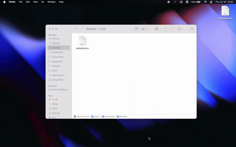
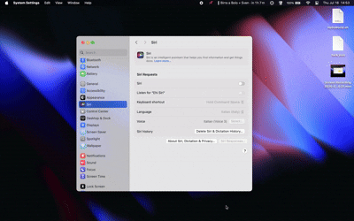

# 📌 Taaaaaaaaaaaaack

Sticky notes that stick to windows, not your desktop.

<p align="center">
  
  <br><br>
  
</p>

Tack is a tiny macOS menu-bar app. Pin a note to a Finder folder or to any app window — the note follows the window as it moves, stays inside its bounds, and reappears when you come back to that window.

- **Finder folders:** the note is saved as a hidden `.tack.json` *inside the folder*, so it travels with the folder when you move or copy it.
- **Other app windows:** notes are kept in a central store, keyed to the window — or to the tab, in Chrome/Safari/Arc (by URL) and Terminal (by tty), so each tab can carry its own note.

No dock icon, no Electron, no dependencies — just AppKit and the Accessibility API.

## Install

```sh
git clone <repo-url>
cd tack
./bundle.sh && open Tack.app
```

Requires macOS 13+ and Xcode command-line tools.

On first launch, macOS asks for permission to control Finder (and later Terminal, for tab notes) and for Accessibility access (needed to track app windows). Grant both; the 📌 appears in the menu bar.

## Use

1. Focus a Finder folder or any app window.
2. Click 📌 → **Add note here**.
3. Type. Drag the note where you want it — it stays glued to that window. Drag any edge to resize it; the size is saved with the note.

Notes style markdown as you type: `**bold**`, `*italic*`, `` `code` ``, `~~strike~~`, `#` headings, `-` bullets, and `- [ ]` todo lists. Click a checkbox to tick it. The markers stay in the text and just fade, so what gets saved is exactly what you typed.

The swatch in the note's corner picks its colour — the palette starts with three and grows via "+". While a note is showing on an app window, the 📌 menu offers **Pin to this window / app** (and **tab**, in Chrome/Safari/Arc and Terminal) to choose how widely it shows. Finder notes have no levels: they live in the folder itself.

Emptying a note's text deletes it.

## Development

```sh
swift build            # debug build
swift run swift-executable --selftest   # run the built-in checks
./bundle.sh            # build + package Tack.app (signed with a keychain identity)
```

## How it works

Tack is one process with two timers and a couple of JSON files.

A slow timer fires every 0.4 seconds and asks macOS which app is frontmost. That decides what the note should attach to:

- If it's Finder, Tack sends a single Apple event asking which folder is in front (the window's position comes from the window list, not the event). The note for that folder lives in a hidden `.tack.json` inside the folder itself, which is why it survives the folder being moved, copied, or synced to another Mac.
- If it's any other app, Tack finds the focused window through the Accessibility API and looks the note up in a central store keyed to that window.

Keeping the note glued to its window works differently in the two cases. Finder doesn't push window-move events over Apple events, so while a folder note is showing, Tack polls the window position at 60fps. Regular app windows are cheaper: an `AXObserver` subscribes to moved and resized notifications, so the note only repaints when the window actually moves.

### How a note knows which tab it's on

macOS doesn't tell you "the user is on tab 3". To know what it's looking at, Tack builds an identity for the focused surface — a path from coarse to fine, like `app / window / tab` — and reads each level from a different source:

- **Any app:** the Accessibility API exposes the focused window's document (`AXDocument`) — the file Preview or TextEdit has open — or, failing that, its title (`AXTitle`). A document path is stable: close the file, reopen it next week, the note comes back. A title is just a guess.
- **Chrome, Safari and Arc:** the window is the wrong identity for a tab — switching tabs mutates the *same* window rather than focusing a new one. So Tack walks the window's accessibility tree down to the web area and reads the page URL, normalised to scheme + host + path (query and fragment are session noise). Each tab *is* its page: the note follows the URL through tab switches, new windows, even a restart.
- **Terminal:** tab titles churn while commands run, so a title-keyed note would vanish mid-build. The tty (`/dev/ttys003`) is the only identity a tab keeps for its whole life, and one Apple event per poll fetches it.

Where this works well, and where it degrades, follows from those sources:

- **Reliable:** document-based apps (`AXDocument` is a real path), Chrome/Safari/Arc tabs (the URL is explicit), Terminal tabs (the tty is stable).
- **Fuzzy:** everything else is keyed by window title. Two windows with the same title share one note, and a title that changes — unsaved-marker asterisks, notification counters, "3 of 10 files" — takes its note with it.
- **Not covered:** browsers not on the URL list (Firefox, ...) degrade to title keying — and since a browser's window title follows the active tab, the note *seems* tab-bound until the page title changes out from under it. Adding a Chromium/WebKit browser is one bundle ID in `BrowserContainer.bundleIDs`, as long as it exposes its web area over Accessibility. Apps with a broken or empty accessibility tree (some Electron apps) may expose nothing to key on and can't hold a note at all.

Pinning a note to the window or app level from the 📌 menu sidesteps a fuzzy tab identity. And if a note refuses to stick where you expect, `defaults write com.tack.app debugPaths -bool YES` makes Tack log the identity it sees (watch with `log stream --predicate 'process == "Tack"'`).

The note itself is a borderless `NSWindow` floating above everything else — a frosted-glass card (`NSVisualEffectView` blurring whatever sits behind it) with the palette colour laid over as a sheer tint. Its position is stored as an offset from the tracked window's top-left corner, and that offset is clamped so the note can never escape the window's bounds. The coordinate math (AppleScript measures from the screen's top-left, Cocoa from the bottom-left) lives in pure functions, which is what `--selftest` asserts on without launching any UI.

⌘C/⌘V/⌘Z work inside a note because of a menu you'll never see: an agent app has no menu bar, but macOS still routes key equivalents through the main menu, so Tack installs an invisible Edit menu purely to give the shortcuts somewhere to land.

Markdown is styled in place rather than rendered. The buffer always holds what you typed — `**milk**` keeps its asterisks — and the styling is attributes painted over the top, with the markers dimmed. Nothing is serialised back, so a note is still a plain string on disk, and anything written before markdown existed opens unchanged. Finding the spans is, again, a pure function the self-tests assert on.

Deleting is implicit: empty a note's text and its file, or store entry, is removed.
