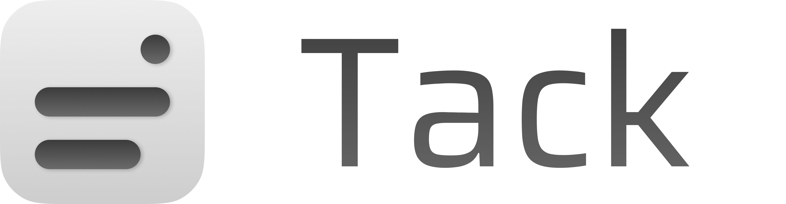

<p align="center">
  
</p>

---

Sticky notes that stick to windows, not your desktop.

<p align="center">
  
</p>

Tack is a tiny macOS menu-bar app. Pin a note to a Finder folder or to any app window — the note follows the window as it moves, stays inside its bounds, and reappears when you come back to that window.

- **Finder folders:** the note is saved as a hidden `.tack.json` *inside the folder*, so it travels with the folder when you move or copy it.
- **Other app windows:** notes are kept in a central store, keyed to the window — or to the tab, in Chrome/Safari/Arc (by URL) and Terminal (by tty), so each tab can carry its own note.

No dock icon, no Electron, no dependencies — just AppKit and the Accessibility API.

## Why Tack?

Plenty of apps let you write a note. Almost none let you stick it *to* something.

| | Tack | Apple Stickies | Apple Notes | Finder comments | Sticky-note apps |
| --- | :---: | :---: | :---: | :---: | :---: |
| Sticks to a specific window or folder | ✅ | ❌ floats on the desktop | ❌ lives in its own app | ✅ folder metadata | ❌ floats on the desktop |
| Follows the window, appears only in context | ✅ | ❌ always visible | ❌ | ❌ buried in Get Info | ❌ always visible |
| Per-tab notes (browser URL, Terminal tty) | ✅ | ❌ | ❌ | ❌ | ❌ |
| Note travels with its folder when moved or copied | ✅ | — | — | ⚠️ xattr, easily lost | — |
| Markdown | ✅ | ❌ | ✅ | ❌ | varies |
| Footprint | menu-bar agent, zero dependencies | built-in | built-in | built-in | usually Electron |
| Free & open source | ✅ | ❌ | ❌ | — | rarely |

If you just want a scratchpad, Stickies is fine. Tack is for notes that belong to a *place* — this folder, this PDF, this tab — and should show up exactly there, and nowhere else.

## Install

Grab the zip for your Mac from the [latest release](../../releases/latest) — `apple-silicon` for M-series, `intel` for Intel — unzip, and **right-click → Open** the first time.

Why the right-click: releases are built by GitHub's CI, which has no Apple Developer certificate, so the app is ad-hoc signed and not notarized. Gatekeeper flags it as from an "unidentified developer" — right-click → Open is the built-in way past that warning, needed once per download. Same cause, second symptom: macOS ties permission grants to the app's signature, and an ad-hoc signature is unique per build, so after downloading an update macOS will re-ask for the permissions below. Everything else — your notes included — carries over untouched.

Building from source avoids both, if you have any codesigning identity in your keychain (`bundle.sh` picks the first one, and keeps the signature — and the permission grants — stable across rebuilds):

```sh
git clone <repo-url>
cd tack
./bundle.sh && open Tack.app
```

Requires macOS 14+ and Xcode command-line tools.

On first launch, macOS asks for permission to control Finder (and later Terminal, for tab notes) and for Accessibility access (needed to track app windows). Grant both; the 📌 appears in the menu bar.

## Use

1. Focus a Finder folder or any app window.
2. Click 📌 → **Add note here**.
3. Type. Drag the note where you want it — it stays glued to that window, and it can't leave it: dragging toward an edge stops the note at the border. Drag any edge to resize it; that edge stops at the window's border too, so growing the note into the border cuts it there instead of pushing the opposite edge out. The size is saved with the note and capped to the window — shrink the window below the note and the note shrinks to fit rather than spilling over, then grows back when the window does.

Notes edit like Notion. Type `**bold**`, `*italic*`, `` `code` ``, `~~strike~~` or a `#`/`##`/`###` heading and the markup is consumed — you see the formatting, not the symbols, even while editing. ⌘B/⌘I toggle emphasis; backspace at the start of a heading turns it back into body text. Lists work the same way: `- ` becomes a bullet (•) and `[]`/`[x]` a checkbox (☐/☑) — click to tick, Enter continues the list, and Enter on an empty item or backspace at its start leaves the list. On disk a note is plain markdown (`- `, `- [ ]`, `- [x]`), so nothing about the file format changed and older notes just work.

Two dots sit in the note's top-right corner. The first wears the note's own colour: click it and the note takes the next colour in the palette, click again to keep going — no menu, no picker. The red one, in the corner, deletes the note (a note with text asks first; emptying its text still removes it too).

The rest is a right-click on the card:

- **Color** — the swatch grid, which is where the cycle's colours come from. The palette starts with four (yellow, pink, blue, white) and grows via "+"; a tiny × on each swatch's corner removes it (the last colour can't be removed).
- **Pin** — how widely the note shows: **this window / this app**, and **this tab** in Chrome/Safari/Arc and Terminal. The entry only appears when there's a choice to make — Finder notes have no levels (they live in the folder itself).

## Development

```sh
swift build            # debug build
swift run swift-executable --selftest   # run the built-in checks
./bundle.sh            # build + package Tack.app (signed with a keychain identity)
```

## How it works

Tack is one process with two loops and a couple of JSON files.

A slow timer fires every 0.4 seconds and asks macOS which app is frontmost. That decides what the note should attach to:

- If it's Finder, Tack sends a single Apple event asking which folder is in front (the window's position comes from the window list, not the event). The note for that folder lives in a hidden `.tack.json` inside the folder itself, which is why it survives the folder being moved, copied, or synced to another Mac.
- If it's any other app, Tack finds the focused window through the Accessibility API and looks the note up in a central store keyed to that window.

Keeping the note glued to its window is the second loop. While a note is showing, Tack reads the window's position on a display link — a timer synced to the screen's own refresh — and repositions the note to match. That's the full rate on a 120 Hz ProMotion display, so the note tracks in lockstep during a drag rather than trailing behind. Every surface is polled the same way: app windows can push their own move notifications over the Accessibility API, but macOS coalesces those mid-drag and the note visibly lagged, so polling won out for Finder folders and app windows alike. What gets polled is the window server's own window list — the process compositing the drag, fresh every frame — not the Accessibility API: an accessibility read is a synchronous round-trip into the tracked app's main thread, which is busy handling the drag at exactly the moment it matters, so the note stuttered. Accessibility is only used to *identify* the focused window (its document, title, or URL) on the slow poll, where that latency is harmless.

### How a note knows which tab it's on

macOS doesn't tell you "the user is on tab 3". To know what it's looking at, Tack builds an identity for the focused surface — a path from coarse to fine, like `app / window / tab` — and reads each level from a different source:

- **Any app:** the Accessibility API exposes the focused window's document (`AXDocument`) — the file Preview or TextEdit has open — or, failing that, its title (`AXTitle`). A document path is stable: close the file, reopen it next week, the note comes back. A title is just a guess.
- **Chrome, Safari and Arc:** the window is the wrong identity for a tab — switching tabs mutates the *same* window rather than focusing a new one. So Tack walks the window's accessibility tree down to the web area and reads the page URL, normalised to scheme + host + path (query and fragment are session noise). Each tab *is* its page: the note follows the URL through tab switches, new windows, even a restart.
- **Terminal:** tab titles churn while commands run, so a title-keyed note would vanish mid-build. The tty (`/dev/ttys003`) is the only identity a tab keeps for its whole life, and one Apple event per poll fetches it.

Where this works well, and where it degrades, follows from those sources:

- **Reliable:** document-based apps (`AXDocument` is a real path), Chrome/Safari/Arc tabs (the URL is explicit), Terminal tabs (the tty is stable).
- **Fuzzy:** everything else is keyed by window title. Two windows with the same title share one note, and a title that changes — unsaved-marker asterisks, notification counters, "3 of 10 files" — takes its note with it.
- **Not covered:** browsers not on the URL list (Firefox, ...) degrade to title keying — and since a browser's window title follows the active tab, the note *seems* tab-bound until the page title changes out from under it. Adding a Chromium/WebKit browser is one bundle ID in `BrowserContainer.bundleIDs`, as long as it exposes its web area over Accessibility. Apps with a broken or empty accessibility tree (some Electron apps) may expose nothing to key on and can't hold a note at all.

Pinning a note to the window or app level — **Pin** in the note's right-click menu — sidesteps a fuzzy tab identity. And if a note refuses to stick where you expect, `defaults write com.tack.app debugPaths -bool YES` makes Tack log the identity it sees (watch with `log stream --predicate 'process == "Tack"'`).

The note itself is a borderless `NSWindow` floating above everything else — a frosted-glass card (`NSVisualEffectView` blurring whatever sits behind it) with the palette colour laid over as a sheer tint. Its position is stored as an offset from the tracked window's top-left corner, clamped *before* every move — Tack drives the drag itself rather than letting AppKit move the window and pulling it back after, so the note stops dead at the window's border instead of escaping and snapping back — and its size is capped to the window too, so a note pinned to a small window shrinks to fit instead of spilling over, and grows back toward its saved size when the window does. The coordinate math (AppleScript measures from the screen's top-left, Cocoa from the bottom-left) lives in pure functions, which is what `--selftest` asserts on without launching any UI.

⌘C/⌘V/⌘Z work inside a note because of a menu you'll never see: an agent app has no menu bar, but macOS still routes key equivalents through the main menu, so Tack installs an invisible Edit menu purely to give the shortcuts somewhere to land.

Markdown is styled in place rather than rendered. The buffer always holds what you typed — `**milk**` keeps its asterisks — and the styling is attributes painted over the top, with the markers dimmed. Nothing is serialised back, so a note is still a plain string on disk, and anything written before markdown existed opens unchanged. Finding the spans is, again, a pure function the self-tests assert on.

Deleting is implicit: empty a note's text and its file, or store entry, is removed.
