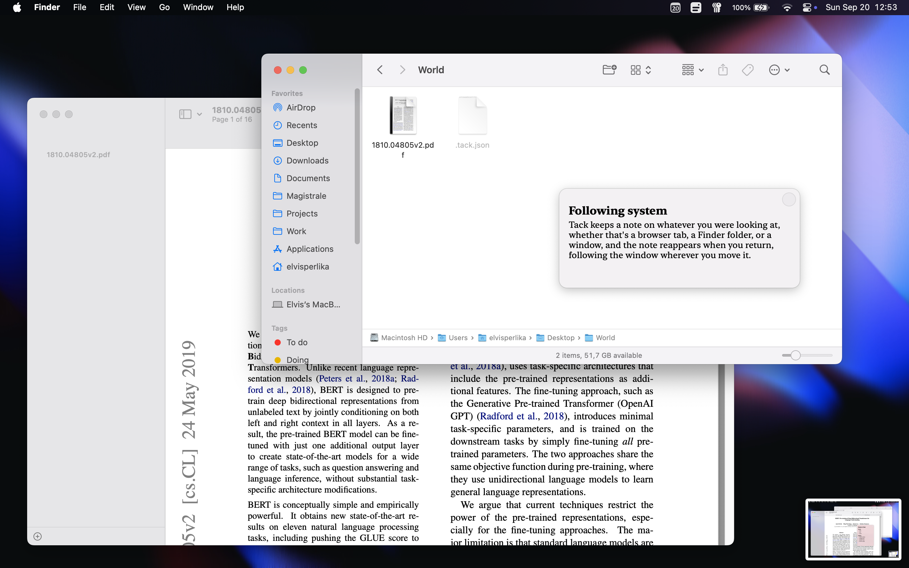
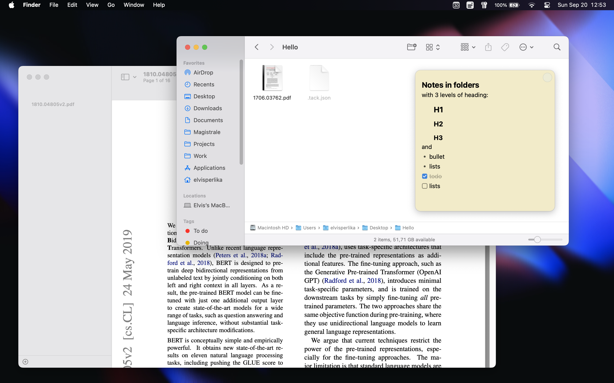
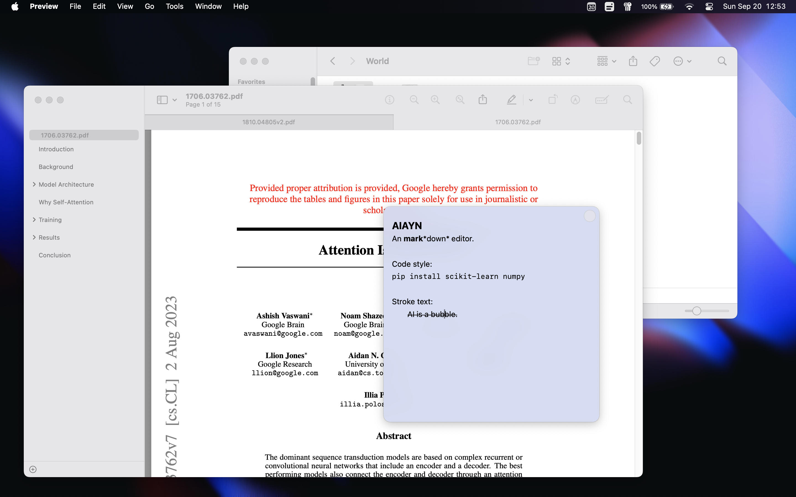
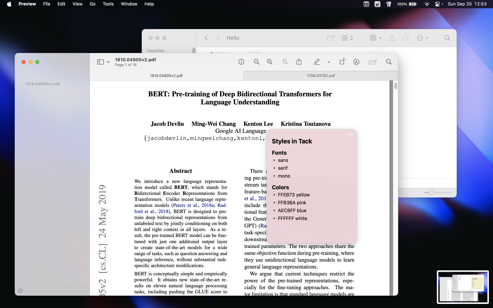
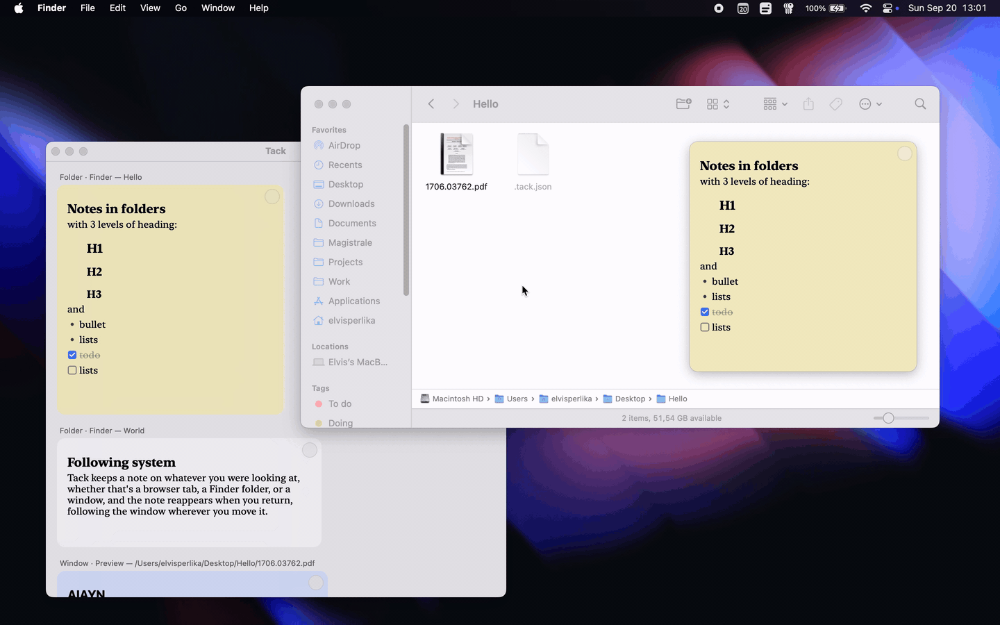
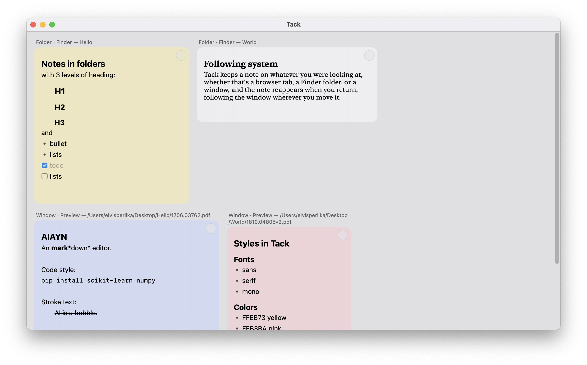

<p align="center">
  
</p>

---

Sticky notes that stick to windows, not your desktop.

<p align="center">
  
</p>

Tack is a small macOS menu-bar app. Pin a note to a Finder folder or to any app window: the note follows that window as it moves, stays inside its bounds, and comes back when you do.

A Finder note is saved as a hidden `.tack.json` inside the folder, so it travels with the folder when you move or copy it. Every other note lives in a central store keyed to the window, or to the tab in Chrome/Safari/Arc (by URL) and Terminal (by tty), so each tab can carry its own.

No dock icon, no Electron, no dependencies. Just AppKit and the Accessibility API.

## Why Tack?

Plenty of apps let you write a note. Almost none let you stick it *to* something.

| | Tack | Apple Stickies | Apple Notes | Finder comments | Sticky-note apps |
| --- | :---: | :---: | :---: | :---: | :---: |
| Sticks to a specific window or folder | ✅ | ❌ floats on the desktop | ❌ lives in its own app | ✅ folder metadata | ❌ floats on the desktop |
| Follows the window, appears only in context | ✅ | ❌ always visible | ❌ | ❌ buried in Get Info | ❌ always visible |
| Per-tab notes (browser URL, Terminal tty) | ✅ | ❌ | ❌ | ❌ | ❌ |
| Note travels with its folder when moved or copied | ✅ | n/a | n/a | ⚠️ xattr, easily lost | n/a |
| Markdown | ✅ | ❌ | ✅ | ❌ | varies |
| Footprint | menu-bar agent, zero dependencies | built-in | built-in | built-in | usually Electron |
| Free & open source | ✅ | ❌ | ❌ | n/a | rarely |

If you want a scratchpad, Stickies is fine. Tack is for notes that belong to a place: this folder, this PDF, this tab, and nowhere else.

## Install

Grab the zip for your Mac from the [latest release](../../releases/latest), `apple-silicon` for M-series or `intel` for Intel, unzip it, and right-click → Open the first time.

Releases are built by GitHub's CI, which has no Apple Developer certificate, so the app is ad-hoc signed and not notarized. Gatekeeper calls it an "unidentified developer", and right-click → Open is the built-in way past that warning, once per download. Same cause, second symptom: an ad-hoc signature is unique per build and macOS ties permission grants to it, so after an update macOS re-asks for the permissions below. Everything else, your notes included, carries over untouched.

Building from source avoids both if you have any codesigning identity in your keychain. `bundle.sh` picks the first one and keeps the signature stable across rebuilds, and the permission grants with it:

```sh
git clone <repo-url>
cd tack
./bundle.sh && open Tack.app
```

Requires macOS 14+ and the Xcode command-line tools.

On first launch macOS asks to control Finder (and later Terminal, for tab notes) and for Accessibility access, which is how Tack tracks app windows. Grant both and the 📌 appears in the menu bar.

## Use

1. Focus a Finder folder or any app window.
2. Click 📌 → Add note here. The note appears in the middle of that window.
3. Type. Drag the note where you want it. It can't leave the window: dragging or resizing toward an edge stops dead at the border, and a note pinned to a window smaller than itself shrinks to fit, then grows back when the window does.

Notes edit in blocks, the way Notion does. Every line is a block, Enter opens the next, the arrows walk between them, and each keeps its own style, so typing at the head of an H1 stays H1. Esc steps out of the text and selects the block you were in; ↑/↓ then walk block by block, and Enter or just typing drops you back in. Backspace deletes the selected block and selects the one above it, and ⌘Z brings it back.

Type `**bold**`, `*italic*`, `` `code` ``, `~~strike~~` or a `#`/`##`/`###` heading and the markup is consumed: you see the formatting, not the symbols, even while editing. ⌘B and ⌘I toggle emphasis, and backspace at the start of a heading turns it back into body text. `- ` becomes a bullet (•) and `[]`/`[x]` a checkbox (☐/☑) you can click to tick. On disk a note is plain markdown.

<p align="center">
  
  
</p>

A small glass dot sits in the note's top-right corner. Put the cursor on it and it opens leftwards into a pill of three dots, floating over the blurred text, and closes again when the cursor leaves. The first dot is a T in the note's typeface, the second wears its colour: click either and the pill widens into the choices, three faces (the system sans, New York serif, mono) or the palette's colours. Rest on a face and its dot opens out to spell *Tack* in that face, so you read the typeface before you pick it. A picker stays up once opened; clicking the card drops it. The red dot deletes the note, and one with text asks first.

<p align="center">
  
</p>

Right-click the card for the rest. Color opens the full swatch grid the pill's colours come from: four to start (yellow, pink, blue, white), "+" adds one, and a tiny × removes one, though the last colour stays. Pin sets how widely the note shows, this window or this app, plus this tab in Chrome/Safari/Arc and Terminal. Pin only appears when there's a choice to make, since Finder notes live in the folder itself and have no levels.

Click 📌 → Open Tack (⌘O) to see every note at once, each card under the window, tab or folder it's pinned to. The cards are live: edit one here or on its own window and the other keeps up as you type. ⌘-click a card's header and that window, tab or folder comes back to the front.

<p align="center">
  
  
</p>

## Development

```sh
swift build            # debug build
swift run swift-executable --selftest   # run the built-in checks
./bundle.sh            # build + package Tack.app (signed with a keychain identity)
```

## How it works

Tack is one process with two loops and a couple of JSON files.

A slow timer fires every 0.4 seconds and asks macOS which app is frontmost, which decides what the note attaches to. For Finder, one Apple event asks which folder is in front (the window's position comes from the window list, not the event), and the note lives in that folder's hidden `.tack.json`, which is why it survives being moved, copied or synced to another Mac. For any other app, Tack finds the focused window through the Accessibility API and looks the note up in a central store keyed to that window.

The second loop keeps the note glued to its window. While a note is showing, Tack reads the window's position on a display link, a timer synced to the screen's own refresh, and moves the note to match: the full rate on a 120 Hz ProMotion display, so the note tracks in lockstep during a drag. Everything is polled, app windows included, even though they can push move notifications over the Accessibility API, because macOS coalesces those mid-drag and the note visibly lagged. What gets polled is the window server's own window list, fresh every frame from the process compositing the drag. An accessibility read would be a synchronous round-trip into the tracked app's main thread, busy handling the drag at exactly the moment it matters, and the note stuttered. Accessibility only *identifies* the focused window on the slow poll, where that latency is harmless.

### How a note knows which tab it's on

macOS doesn't tell you "the user is on tab 3". Tack builds an identity for the focused surface, a path from coarse to fine like `app / window / tab`, and reads each level from a different source:

- Any app: the Accessibility API exposes the focused window's document (`AXDocument`), the file Preview or TextEdit has open, or failing that its title (`AXTitle`). A document path is stable, so close the file, reopen it next week, and the note comes back. A title is just a guess.
- Chrome, Safari and Arc: switching tabs mutates the *same* window rather than focusing a new one, so the window is the wrong identity for a tab. Tack walks the window's accessibility tree down to the web area and reads the page URL, normalised to scheme + host + path (query and fragment are session noise). Each tab *is* its page, and the note follows the URL through tab switches, new windows, even a restart.
- Terminal: tab titles churn while commands run, so a title-keyed note would vanish mid-build. The tty (`/dev/ttys003`) is the only identity a tab keeps for its whole life, and one Apple event per poll fetches it.

Document-based apps, browser tabs and Terminal tabs are reliable. Everything else is keyed by window title, so two windows with the same title share one note, and a title that changes (an unsaved-marker asterisk, a notification counter, "3 of 10 files") takes its note with it. Browsers not on the URL list, Firefox among them, fall back to title keying, and since a browser's title follows the active tab the note *seems* tab-bound until the page title changes under it. Adding a Chromium or WebKit browser is one bundle ID in `BrowserContainer.bundleIDs`, as long as it exposes its web area over Accessibility. Apps with a broken or empty accessibility tree, some Electron ones, can't hold a note at all.

Pinning a note to the window or app level sidesteps a fuzzy tab identity. And if a note refuses to stick where you expect, `defaults write com.tack.app debugPaths -bool YES` makes Tack log the identity it sees (watch with `log stream --predicate 'process == "Tack"'`).

The note itself is a borderless `NSWindow` above everything else: a frosted-glass card (`NSVisualEffectView`) with the palette colour laid over as a sheer tint. Its position is an offset from the tracked window's top-left corner, clamped *before* every move, so Tack drives the drag itself rather than letting AppKit move the window and pulling it back after. Its size is capped the same way. The coordinate math (AppleScript measures from the screen's top-left, Cocoa from the bottom-left) lives in pure functions, which is what `--selftest` asserts on without launching any UI.

⌘C/⌘V/⌘Z work inside a note because of a menu you'll never see: an agent app has no menu bar, but macOS still routes key equivalents through the main menu, so Tack installs an invisible Edit menu purely to give the shortcuts somewhere to land.

Markdown is styled in place rather than rendered. The buffer always holds what you typed, `**milk**` keeps its asterisks, and the styling is attributes painted over the top with the markers dimmed. Nothing is serialised back, so a note is still a plain string on disk. Finding the spans is, again, a pure function the self-tests assert on.

Deleting is implicit: empty a note's text and its file, or store entry, is removed.
